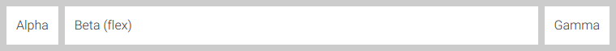

# Preamble

This CSS file is a modified version of the layout capabilities in the javascript library [Polymer](https://www.polymer-project.org) (Version <= 0.5) from Google.

It provides flexible horizontal and vertical layout with CSS3 flexboxes.

# How to use

In your HTML-file simply include the `layout.css`:

    <head>
        ...
        <link rel="stylesheet" href="layout.css" />
        ...
    </head>

From then every following attributes and features are accessable.

# Attributes

## Horizontal and vertical layout

When a container includes the `layout` attribute, it can become a flex container.
You can specify `horizontal`, `vertical` to change the orientation:

    

        
One

        
Two

        
Three

    

### Flexible children

Children of an element using the `layout` attribute can use `flex` attributes to control their own sizing. For example:

    

        
Alpha

        
Beta (flex)

        
Gamma

    

The same is true for children of `vertical` elements:

    

        
Alpha

        
Beta (flex)

        
Gamma

    

**Note**: for vertical layouts, the container needs to have a height for the children to flex correctly.

Children elements can be told to take up more space by including a "flex ratio" with the `flex` attribute. A flex ratio is specified with a number string: _one_, _two_, _three_, currently up to _twelve_.

For example, to make "Gamma" 2x larger than "Beta" and "Alpha" 3x larger, use `flex two` and `flex three`, respectively:

    

        
Alpha

        
Beta

        
Gamma

    

### Cross-axis alignment

By default, children stretch to fit the cross-axis (e.g. _vertical_ stretching in a _horizontal_ layout).

    

        
Stretch Fill

    

Center _across_ the main axis (e.g. _vertical_ centering elements in a _horizontal_ layout)
by adding `center`.

    

        
Center

    

You can also position at the top/bottom (or left/right in `vertical` layouts) using `start` or `end`.

    

        
start

    

    
    

        
end

    

## Justification

Justifying content is done with the `*-justified` attributes.

**Example** - start justified

    

        
start-justified

    

**Example** - center justified

    

        
center-justified

    

**Example** - end justified

    

        
end-justified

    

**Example** - equal space between each element

    

        
justified

        
justified

        
justified

    

**Example** - equal space around each element

    

        
around-justified

        
around-justified

    

## Self alignment

Alignment can also be set per-child (instead of using the layout containers rules):

    

        
Alpha

        
Beta

        
Gamma

        
Delta

    

## Wrapping

Wrapped layouts can be enabled with the `wrap` attribute.

    

        
Alpha

        
Beta

        
Gamma

        
Delta

    

## Reverse order

Layout direction can be mirrored with the `reverse` attribute.

    

        
Alpha

        
Beta

        
Gamma

        
Delta

    

# Image and text sources

The example images are screenshots taken from [https://www.polymer-project.org/0.5/docs/polymer/layout-attrs.html](https://www.polymer-project.org/0.5/docs/polymer/layout-attrs.html) (access date: 2015-20-06).

The text is modified and taken also from [https://www.polymer-project.org/0.5/docs/polymer/layout-attrs.html](https://www.polymer-project.org/0.5/docs/polymer/layout-attrs.html) (access date: 2015-20-06).
